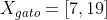

[](https://www.linkedin.com/in/mauricio-eloy) [](https://www.python.org/downloads/release/python-365/) [](http://perso.crans.org/besson/LICENSE.html) [](https://github.com/MauricioEloy/Portifolio/issues)

<p align="center">

</p>

# <span style="color:blue"> Introdução ao algoritmo K-Nearest Neighbor (KNN) </span>

**Mauricio Eloy**<br>

---
###### Contatos:
*email:* profmauricioeloy@gmail.com

*LindedIn*: https://www.linkedin.com/in/mauricio-eloy/

---
## <span style="color:blue">Objetivo</span>

O objetivo deste módulo é fazer com que você compreenda o algoritmo K-Nearest Neighbor (KNN).


## <span style="color:blue">Problemas Iniciais</span>

O algoritmo dos k vizinhos mais próximos (KNN), faz parte dos modelos de aprendizagem supervisionada, deste modo vamos recordar alguns problemas em que os modelos de aprendizagem superviosanados podem resolver.

### <span style="color:blue">Classificação de Animais</span>

Por meio de um conjunto de imagens rotuladas, um classificador supervisionado pode ser treinadado para classificar imagens.

Um exemplo clássico é o de classificar uma imagem em gato ou cachorro.

<p align="center">

</p>


### <span style="color:blue">Marketing de Cartão de crédito</span>

Outro exemplo de aplicação seria identificar o quão similiar alguns clientes são em relação aos que já aceitaram um determinado produto.

Um exemplo desta abordagem, seria o das campanhas de Marketing de Cartão de Crédito, ao invés de ser gerada uma lista aleatória de clientes, o ideal seria listar aqueles que são mais propensos a aceitar o mesmo, e isto poderia ser feito por um classificador que levasse em conta a similaridade dos clientes.

<p align="center">

</p>

### <span style="color:blue">Classificação de whisky escocês puro malte</span>

Agora imagine um exemplo nem um pouco comum. Suponha que você queira criar um classificador que atuará como degustador de whisky, isso mesmo, **degustador de whisky**.

Parece estranho, mas isso é possível criar um classificar que leva em conta as características do whisky, caso você queira mais detalhes pode consultar o estudo por meio do link https://bit.ly/32XwcP4 

<p align="center">

</p>

## <span style="color:blue">Motivação</span>

Agora que você já recordou alguns problemas que podem ser resolvidos por um modelo de aprendizado supervisionado, você deve estar se perguntando como o algoritmo KNN funciona.

Pois bem, vamos refletir sobre a seguinte situação: 

Será que é possével fazermos uma classificação através da distância entre objetos?

Se sim. Como definir e calcular tal distância?

Vamos analisar o exemplo abaixo, onde temos a imagem de um cachorrinho, centro da imagem, a ser classificado em cachorro ou gato. 

<p align="center">

</p>

Como poderíamos definir e calcular a distância desta imagem a uma imagem considerada similar a ela? A partir desta resposta poderíamos classificar tal objeto.

Para responder esta pergunta devemos nos recordar que um classificador supervisionado necessita essencialmente de exempĺos rotulados com as suas respectivas características, os **ATRIBUTOS**.

Deste modo, suponha que cada imagem fosse composta por n atributos agregados de forma sequencial em um *vetor de atributos*.

A tabela abaixo mostra um exemplo deste tipo de organização, onde cada objeto (imagem) é representado por um vetor de atributos.

Objeto|   |     Vetor de Atributos     | Classe
:-----:|-----|:-----------------------:|:-----:
 |  |  | Cachorro
  |  | **Distância**  |     
 |   |  | Gato


A partir deste vetor de atributos, podemos calcular a distância entre eles. 

Na próxima seção você terá algumas definições que lhe auxiliarão no entendimento do cálculo da distância.

## <span style="color:blue">Definições</span>

### <span style="color:blue">Aprendizado Baseado em Proximidade</span>

O algoritmo KNN é um exemplo deste tipo de aprendizado baseado em proximidade, onde o seu uso mais comum ocorre em modelos de classificação.

Para tanto, como vimos anteriormente usa-se a proximidade dos objetos para predizer o seu rótulo, supõem-se que objetos pŕoximos são semelhantes.

Este tipo de aprendizado não tem um fase explícita de treinamento, já que é baseado nas instâncias, nos exemplos de treinamento, então o algoritmo memoriza as instâncias e as utiliza para classificar um novo exemplo, por este motivo, algoritmos com este viés são considerados *lazy*, preguiçosos.

### <span style="color:blue">Tipos de Medidas</span>

Vamos agora definir dois tipos de medidas:

**1. Medida de Similaridade:**<br>
* Mede o quão similar dois objetos são;
* A distância entre o mesmo objeto é máxima  é máxima <br>

**2. Midida de Dissimilaridade:**<br>
* Mede o quão dissimilar dois objetos são;
* A distância entre o mesmo objeto é ZERO <br>

### <span style="color:blue">Métricas de Distância:</span>

Lembra do exemplo dado anteriormente, aquele de classificar uma imagem utilizando o seu vetor de atributos, pois bem, para resolvê-lo você ficou na pendência de entender formas de cálcular a distância, este é o momento.

Há várias formas de calcular a distância entre objetos.

A mais clássica é a distância Euclidiana, que é definida matematicamente como:

<p align="center">

<p>

Vamos ilustrar o uso desta distância utilizando um exemplo bem simples, a partir da figura abaixo.
<p align="center">

<p>

Suponha que nesta imagem temos que calcular a distância da dúvida até o gato e o cachorro, para isso temos os seguintes vetores de características de cada imagem:

1. Dúvida: 
2. Cachorro: 
3. Gato: 

Com essas informações podemos calcular as distâncias euclidianas d1 e d2, deste modo:

<p align="center">

<p>
<p align="center">

<p>

O que você pode concluir neste momento?

Isso mesmo, a nossa dúvida esta mais próxima de ser um cachorro do que um gato, isso significa que o vizinho mais próximo da nossa dúvida é um cachorro, se fossemos utilizar a ideia de um vizinho mais próximo (1-NN), deveríamos classificá-la como cachorro.

Se você, neste momento, esta se recordando das aulas sobre o Teorema de Pitágoras que teve colégio. Devo te parabenizar por ter lembrado, a distância Euclidiana é uma generalização do teorema de pitágoras que você viu no colégio.

Existem diversos tipos de distâncias que podem ser utilizadas. O importante é entender se a distância em questão faz sentido na resolução do seu problema.

A seguir você encontra algumas das distâncias que podem ser utilizadas.

**1. Minkowski** 
<p align="center">
<br>
<p>
<p align="center">

<p>
        
**2. Euclidiana** 
<p align="center">
<br>
<p>
<p align="center">

<p>

**3. Manhattan** 
<p align="center">
<br>
<p>
<p align="center">

<p>
    
**4. Cosseno** 
<p align="center">
<br>
<p>
<p align="center">

<p>


**Extra:** Caso queira aprofundar o seu estudo sobre as distâncias, você pode consultar o link abaixo:

   - https://bit.ly/3J7TYqY

## <span style="color:blue">Algoritmo KNN</span>

### <span style="color:blue">Etapas</span>
A execução do algoritmo KNN segue as seguintes etapas:

1. Identificar os k-vizinhos mais próximos do vetor de atributos (X) a ser classificado;

2. Determinar o número de vizinhos em cada classe;

3. Classificar o objeto (X) como pertencente à classe majoritaria.

Suponha que você deva classificar o quadrado azul na imagem abaixo em bolinha verde ou vermelha. A imagem mostra a distribuição dos elementos a partir de dois atributos, eixo x e eixo y do plano.

<p align="center">

<p>

Vamos analisar dois cenários seguindo os passos do algoritmo.

**Cenário 1:** Utilizando k=3.

1. Como k=3, temos que identificar os 3 elementos mais próximos do quadrado azul;
2. Computando esses 3 elementos, concluímos que 2 deles são vermelhos e 1 é verde.
3. Deste modo, temos que a classe majoritária é vermelha, assim devemos classificar o quadrado azul como sendo uma bolinha vermelha.

**Cenário 2:** Utilizando k=5.

1. Como k=5, temos que identificar os 5 elementos mais próximos do quadrado azul;
2. Computando esses 5 elementos, concluímos que 2 deles são vermelhos e 3 são verdes.
3. Deste modo, temos que a classe majoritária é verde, assim devemos classificar o quadrado azul como sendo uma bolinha verde.

Você acabou de perceber um problema neste algoritmo, dependendo do número de vizinhos a serem utilizados podemos classificar o objeto pertencendo a uma classe ou outra.

Você deve estar se perguntando: Como definir o melhor valor de k?

Vamos lá!

### <span style="color:blue">Como obter o melhor valor de k</span>

Visto o problema apresenatado anteriormente, não se torna trivial obter o melhor valor de **k**.

Uma boa maneira de se obter o melhor valor para **k** é utilizar a validação cruzada e uma medida para avaliar o resultado, a acurácia por exemplo, evitando assim tanto o *overfitting* quanto *underfitting*.

Analisando a imagem abaixo você pode perceber a diferença das superfícies de decisão ao se utilizar k=1 e k=23.

Para k = 1 | Para k = 23
:---:|:---:
 | 

**Extra:** Caso queira verificar uma discussão sobre esta parte teórica,  você pode consultar o link abaixo:

   - https://bit.ly/3Lan4b7

## <span style="color:blue">Algoritmo na Prática</span>

Dado a parte teórica do algoritmo, agora é hora de colocarmos a mão na massa, ou melhor, a mão no código.

<p align="center">

<p>

Links úteis:
* Vídeo da aula: https://bit.ly/34lGLfB
* Material do vídeo: https://github.com/betrybe/mauricioevandro-test/blob/main/Aula/notebook/supervisioned_knn.ipynb

## <span style="color:blue">Exercícios</span>

1. Explique o motivo do algoritmo KNN ser considerado um algoritmo preguiçoso.
2. Por que é necessário padronizar os dados antes de aplicar o algoritmo KNN?
3. Descreva como obter o melhor valor de k, segundo o que foi visto na aula.
4. Considere a base de dados *breast-cancer* disponível no ```sklearn.datasets```, a partir dela você deve treinar um modelo KNN. Essencialmente você deve:
   * verificar a quantidade de elementos de cada classe na variável alvo, chamada de ```target```;
   * utilizar a proporção de 80% dos dados para treino e 20% para teste;
   * obter o melhor valor de k utilizando-se da validação cruzada com o número de *folds* sendo 10 e o *range* de 1 a 25, inclusive, para o valor de k;
   * treinar o modelo com o melhor valor possível para k;
   * computar o valor da acurácia no conjunto de teste.
   
   Para mais informações sobre os dados utilizados consulte:
   * https://bit.ly/3sl1KqT
   * https://bit.ly/35Fim4O

   O arquivo para iniciar a sua resolução você encontra em:
   * https://github.com/betrybe/mauricioevandro-test/blob/main/Aula/notebook/supervisioned_knn_Q4.ipynb

5. (Extra) De maneira complementar ao exercício anterior, você deve:
   * verificar a separação dos dados no plano utilizando as variáveis ```mean radius``` e ```mean texture```;
   * comparar as diferentes regiões de separação criadas através do *plot* das mesmas. Utilize as mesmas variáveis do item anterior para fazer o plot e os seguintes valores para k: ```[1,3,7,8,9]```

**Gabarito:** 

Disponível em: 
   * https://github.com/betrybe/mauricioevandro-test/blob/main/Aula/notebook/supervisioned_knn_Gabarito.ipynb

## <span style="color:blue">Referências Bibliográficas:</span>

1. AMARAL, F. Introdução a ciência de dados: Mineração de Dados e Big Data. Rio de Janeiro: Alta Books, 2016.
2. FACELI, K. et al. Inteligência Artificial: Uma Abordagem de Aprendizado de Máquina. Rio de Janeiro: LTC, 2011.
3. PROVOST, F., FAWCETT, T. Data science para negócios: O que você precisa saber sobre mineração de dados e pensamento analítico de dados. Rio de Janeiro: Alta Books, 2016

